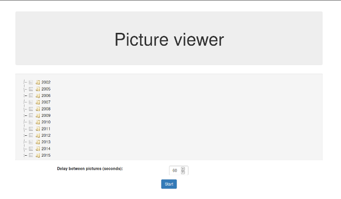

# Web slideshow viewer

Web based picture viewer useful to turn a tablet into a digital photo frame.

## Introduction

This tools is a client/server application that can be used on every mobile device to display a slideshow of some pictures that are stored on a server (or NAS, etc.) in your local network.

It is composed of a client part that retrieves the list of folders from the server and allows the user to select which folders the pictures to be displayed are in. Then it starts asking the server one picture at a time.

The server part is based on **node.js** and it is so simple that can be run on a **Raspberry Pi** device (I actually run it on a RPi device with a nodejs version as old as v0.10.9). This part retrieves the list of folders and then one picture at a time when requested by the client.

The server can be accessed by multiple clients at once because each one has its own session with a separate list of pictures to be displayed.

## Installation

After having downloaded this repository on your server you have to

    cd picture-viewer/server
    npm install

to get all the dependencies (there are a few).

Then there are two configuration files to be copied and customized:

    cd picture-viewer/server
    cp config.js.in config.js

and in `config.js` edit `BASEDIR` to contain the directory to scan for the picture folders.

The second file to be customized is for the front end:

    cd picture-viewer/web/js
    cp config.js.in config.js

There you can edit the default delay between the pictures and the background color behind the displayed picture.

I didn't put these files in the repository otherwise they whould be overwritten at every update.

## Start

To start the server:

    cd picture-viewer/server
    node server.js

The default server port is 8888. You can pass in an optional parameter to specify the port, e.g.:

    node server.js 8080

## LICENSE

This software is under the GNU GENERAL PUBLIC LICENSE Version 3. For more information about using/distributing the software see [http://www.gnu.org/licenses/gpl.html](http://www.gnu.org/licenses/gpl.html).

THE SOFTWARE IS PROVIDED "AS IS" AND THE AUTHOR DISCLAIMS ALL WARRANTIES WITH REGARD TO THIS SOFTWARE INCLUDING ALL IMPLIED WARRANTIES OF MERCHANTABILITY AND FITNESS. IN NO EVENT SHALL THE AUTHOR BE LIABLE FOR ANY SPECIAL, DIRECT, INDIRECT, OR CONSEQUENTIAL DAMAGES OR ANY DAMAGES WHATSOEVER RESULTING FROM LOSS OF USE, DATA OR PROFITS, WHETHER IN AN ACTION OF CONTRACT, NEGLIGENCE OR OTHER TORTIOUS ACTION, ARISING OUT OF OR IN CONNECTION WITH THE USE OR PERFORMANCE OF THIS SOFTWARE.
